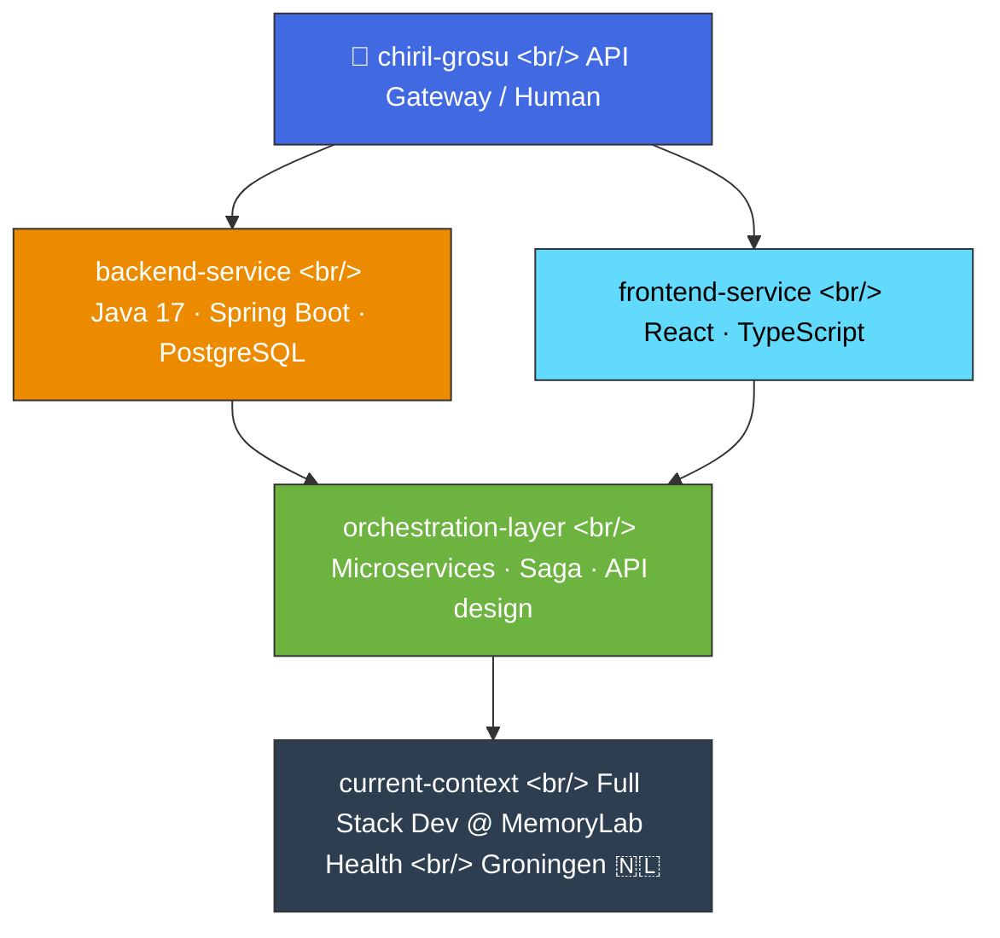

<h1 align="center">
  
</h1>

<p align="center">
  
</p>

---

### 🧩 System Overview



<details>
<summary>💻 <code>GET /whoami</code></summary>
<br>

```json
{
  "role": "Java Full Stack Developer",
  "stack": ["Spring Boot", "Microservices", "PostgreSQL", "React"],
  "location": "Groningen, NL",
  "status": "open_to_interesting_problems"
}
```
</details>

---

### 🛠️ Tech Stack


---

### 🐍 Contribution Snake

<p align="center">
  
</p>

---

### 📫 Reach Me

[](https://linkedin.com/in/chiril-grosu-5b5095191)

<p align="center"><i>~ built with Spring Boot energy, deployed with curiosity ~</i></p>
